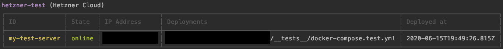

# Clocker - CLoud doCKER
clocker is a command line tool, that help you to set up remote server and deploy your docker-compose file with just a few commands.

```shell script
clocker add
// Configure your server <my-server>

clocker start <my-server>
// Create a new server based on configuration and provision it, ready for docker 

clocker deploy <my-server> ./docker-compose.yml
// Deploy your project to the server. Exposed ports are reachable via server ip 
```

You can set up a new server in minutes, without any manual server configuration, destroy and re-create it anytime you need.

It's ideal for you if you ...  
... need a small service online every now and then without setting up a server every time or paying for a server you don't use or that is not running.  
... want a place to quickly showcase a project in a more realistic environment.  
... have a small budget or no experience in server administration but want your work online.

clocker exposes all the magic it does in terraform templates and docker commands.  
When you want to get more professional, you can use this as a starting point for a more advanced provisioning.

## ❗Do not use in production❗️
This project is in a very early stage and just a proof of concept for now.

It sure has many bugs and design flaws that will destroy your deployed project without backup or recovery.

Only the minimal happy path is working for now.

## TOC
1. [Overview](#Overview)
2. [Supported providers](#Supported-providers)
3. [Installation](#Installation)
4. [Usage](#Usage)
5. [Limitations & Known Problems](#Limitations-&-Known-Problems)
6. [Development](#Development)
7. [Intention & Goals](#Intention-&-Goals)
8. [License](#License)

## Overview
See below for more details on how to [install](#Installation) and [use](#Usage) clocker.
### Step 1: Configure a new server
```shell script
clocker add
```


### Step 2: Start your server
```shell script
clocker start my-test-server
```


### Step 3: Deploy your project
```shell script
clocker deploy my-test-server ./test/docker-compose.test.yml 
```


### Step 4: Check server
```shell script
clocker list
```


## Supported providers
- [DigialOcean](https://www.digitalocean.com/)
- [Hetzner Cloud](https://www.hetzner.com/cloud)

### Planed 
- AWS [#2](https://github.com/KayDomrose/clocker/issues/2)

## Installation

### Supported OS
clocker is tested only on OSX yet.

Linux may also be supported, as clocker only uses terraform, docker and some basic cli tools under the hood.


### Prerequisites 
These tools need to be installed and executable in your cli:
- [Node & NPM](https://nodejs.org/en/)  
`npm -v`
- [Terraform](https://learn.hashicorp.com/terraform/getting-started/install)   
`terraform -v`
- [Docker](https://docs.docker.com/desktop/)  
`docker -v`

### Install clocker
```shell script
npm install -g @kay.domrose/clocker
```

## Usage
clocker is designed to run from anywhere in your cli, so you don't need a special folder or something.

You can always add `--verbose` to any command to see in detail what clocker is doing or more information about errors. 

### Initialize clocker
Before you can use clocker, it has to be initialized.  
In your favorite cli, run: 
```shell script
clocker init
```

This will create a `.clocker` folder in your home directory, where clocker stores stuff about your servers.

### List all configured servers
You can get an overview of all servers configured, whether they are running or not and which projects have been deployed.
```shell script
clocker list
```

### Add a server
```shell script
clocker add
```
A configuration wizard will ask you some questions about which provider you want to use and other configuration.  
**Nothing will be actually created yet**, so its save to play around.

Under the hood, we use terraform to create templates on how your server should look like.  
You can see all files that are created for your server in `.clocker/servers/<your-server-id>` in your home directory.

### Start a server
After you've added a server, it's time to start it: 
```shell script
clocker start <your-server-id>
```

This will use the terraform templates mentioned above to:
1. Create a fresh server at your cloud provider of choice.
2. Provision the server once created:
    1. Install docker, vim, nginx
    2. Create a `worker` user, which is used to interact with the server (instead of root)
    3. Deploy a docker test container to check whether the server is ready or not (`http://<server-ip>:11111`)

Clocker will prompt you the ip of your new server once its created and provisioned successfully.
    
You can also access the server manually via ssh by running `ssh worker@<server-ip>`.     
 
 ### Deploy a docker-compose file
clockers main purpose is to easily deploy your local docker-compose project to a remove server.  
Before you do so, check the [limitations section](#Limitations) for potential problems.
 
If you don't have a docker-compose file ready or just want to try clocker, you can use [this docker-compose file](https://github.com/KayDomrose/clocker/blob/master/tests/docker-compose.test.yml) for a test.

Make sure your server is running, then run: 
```shell script
clocker deploy <your-server-id> <path-to-your-docker-compose-file>
```
Any service in your compose file, that exposes a port, can be accessed with your server ip: `http://<server-ip>:<exposed-port>`.  
In the docker-compose file mentioned above, the service exposes port 7000, so you can access it in your browser `http://<server-ip>:7000`. 
 
### Stop a server
As most cloud server providers will still charge you even when the server is not running, clocker will instead destroy the server and create a new one when you need it again.

To stop a running server, run: 
```shell script
clocker stop <your-server-id>
```

### Remove a server
If you want to completely remove a server in clocker, run: 

```shell script
clocker remove <my-server-id>
```

### Customize / Eject
clocker saves all configuration it needs to work with your server in a single directory at `.clocker/servers/<your-server-ip>`, including the terraform state.  
There is nothing hidden elsewhere, so feel free to explore.

The main idea of clocker is to give you a good kickstart for new projects, you want to deploy, but also give you anything you need to customize the basic setup.

If you want to modify or extend your server configuration, run
```shell script
clocker eject <my-server-id> <target-path>
```
clocker will move all necessary files to your target directory, including terraform template, variables and state. Now you can change these configurations and clocker will not overwrite them.  
You can't manage this server via clocker anymore, but can run the terraform commands yourself.
 

## Limitations & Known Problems
1. There is no persistent storage (yet) to store files created or used in your docker-compose. [#8](https://github.com/KayDomrose/clocker/issues/8)
2. Multiple compose files deployed to the same server may use same ports.

## Development
1. Clone repo
2. Install dependencies `npm install` (you also need Terraform and Docker)
3. Create environment `cp .env.example .env` and configure
4. Run clocker commands `npm run command ARGS -- FLAGS`.  
For example:`npm run command init`.  
To add flags, add them at the end, separated by ` -- ` (e.g. `npm run command init -- --verbose`).

After you are done with your work, run `npm run build` to create a test-build. This will be linked with npm (`npm link`), so you can use clocker as you would normally do (`clocker ARGS`).

## Intention & Goals
Setting up a remote server to run a dockerized project can be difficult and hard to work out, especially for inexperienced developers, who just want to see their project running.

By automatising the server provisioning with a default docker environment, this project can help you to easily spin up a remote server and deploy your project, ready to be used, in just a few clicks.  

It is by no means a professional tool to run your production application on.

There is no magic going on. Under the hood, clocker uses terraform and docker-cli to create, provision and deploy. 


## License
clocker is [MIT licensed](https://github.com/KayDomrose/clocker/blob/master/LICENSE.md).
