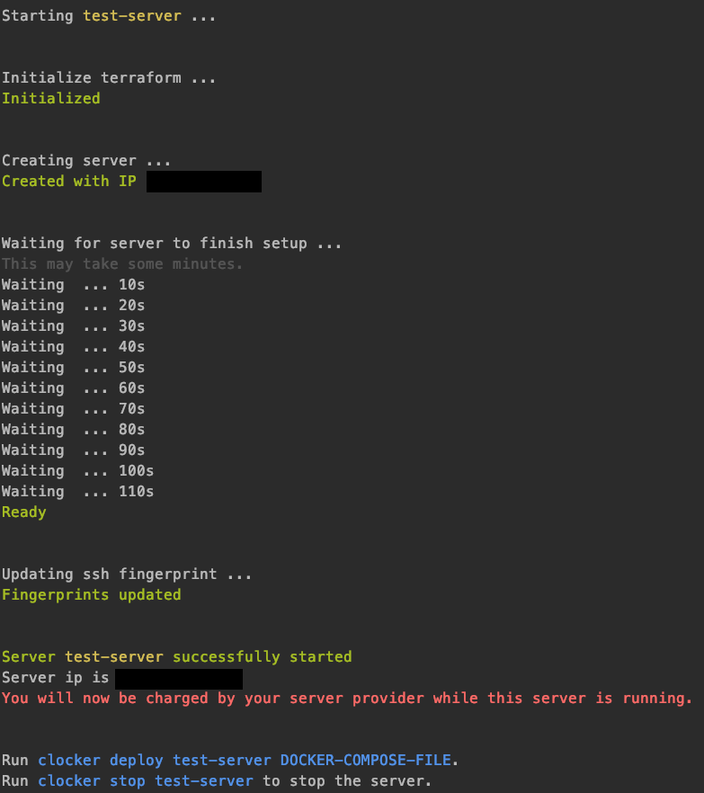

# Clocker - CLoud doCKER
Create and provision cloud server with just a few commands, ready to be deployed with your docker-compose project.

## Do not use in production
Use only for development or testing, as there shall be bugs or design flaws that could destroy your project.

## Overview

### Step 1: Configure a new server
```shell script
clocker add
```


### Step 2: Start your server
```shell script
clocker start my-test-server
```


### Step 2.1: Check servers
```shell script
clocker list
```


### Step 3: Deploy your project
// TODO

## Supported hoster
- [Hetzner Cloud](https://www.hetzner.com/cloud)

## Intention & Goals
Setting up a remote server to run a dockerized project can be difficult and hard to work out, especially for inexperienced developers, who just want to see their project running.

By automatising the server provisioning with a default docker environment, this project can help you to easily spin up a remote server and deploy your project, ready to be used, in just a few clicks.  

It is by no means a professional tool to run your production application on.

## Installation

### Prerequisites 
- [Terraform](https://learn.hashicorp.com/terraform/getting-started/install)
- [Docker](https://docs.docker.com/desktop/)

### Install clocker


## Usage

### Init clocker
Before you can use clocker, it has to be initialized first.  
From anywhere, run `clocker init`.

This will create a `.clocker` folder in your home directory, where clocker stores some information about the servers.

### List all configured servers
Using `clocker list` will give you an overview of all servers configured an whether they are running or not.

### Add a server
Run `clocker add`.  
A configuration wizard will ask you some questions about which provider you want to use and other configuration.  
There is no server created jet.

Under the hood, we use terraform to create templates about how your server should look like.  
You can see all files that are created for your server in `.clocker/servers/<your-server-id>` in your home directory.

### Start a server
After you've added a server, it's time to start it: `clocker start <server-id>`.  
Replace `<server-id>` with the id you gave your server in the step before.

This will use the terraform templates to:
1. Create a server at your given cloud provider
2. Provision the server once created with
    1. Install docker, vim, nginx
    2. A `worker` user, which is used to interact with the server (instead of root)
    3. Deploy a docker test container to check whether the server is ready or not (`http://<server-ip>:11111`)
    
Use `clocker list` to check which server is running.
 
### Stop a server
To stop a running server, use `clocker stop <server-id>`.

As most cloud server providers will still charge you even when the server is stopped, clocker will instead destroy the server and create a new one when started again.

## Limitations
1. There is no persistent storage (yet) to store files created or used in your docker-compose.

## Development

1. Clone repo
2. Install dependencies `npm install` (Terraform and Docker are also needed)
3. Create environment `cp .env.example .env` and configure
4. Run commands `npm run command CLOCKER-ACTION CLOCKER-ARGS`: `npm run command init`
5. Execute locally as clocker: `npm link`
